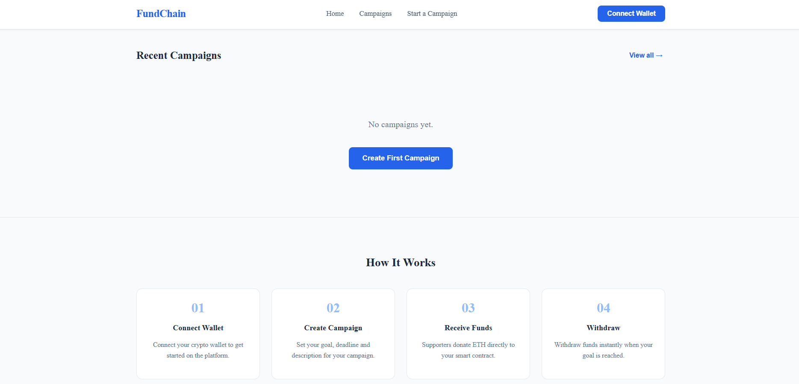
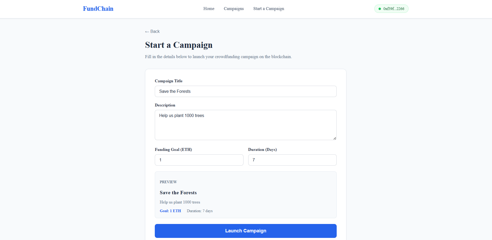
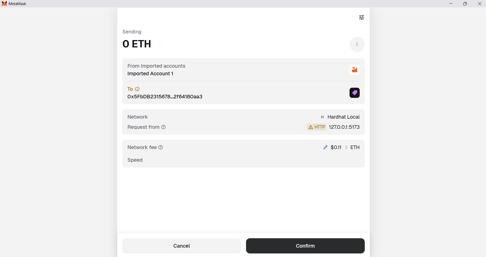
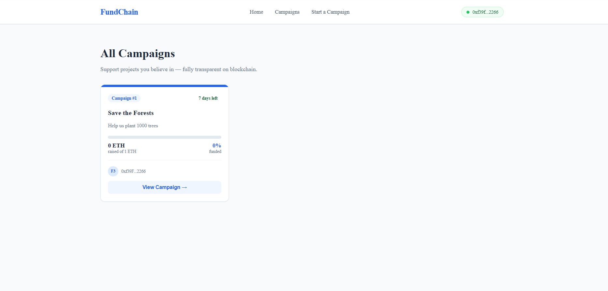
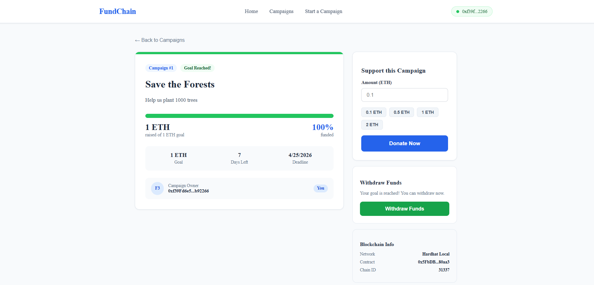
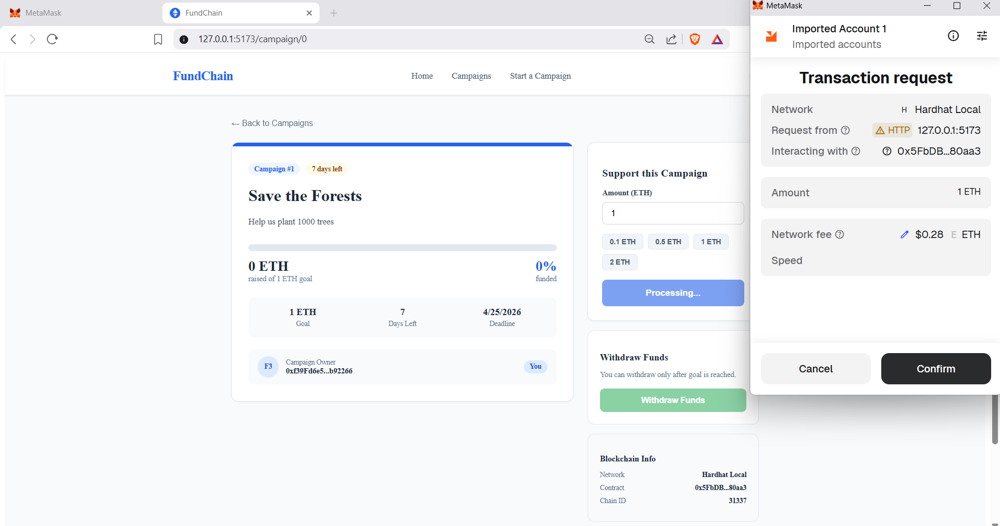
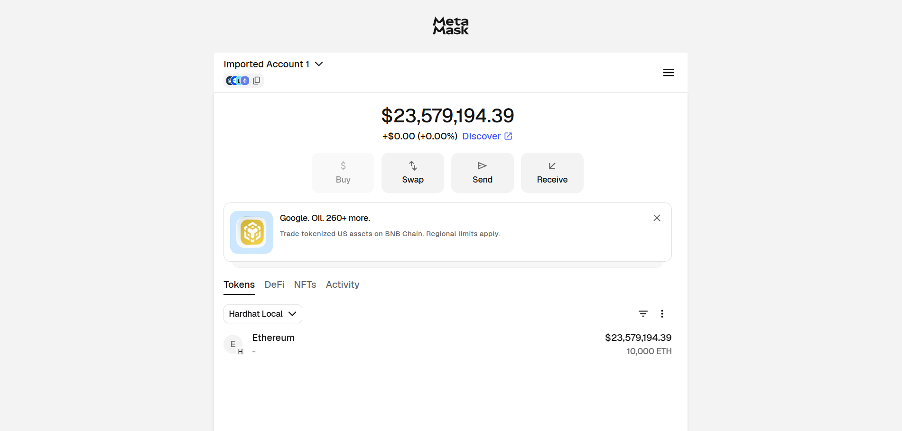

# FundChain

<div align="center">


**A decentralized crowdfunding platform — create campaigns, donate ETH, and withdraw funds secured by smart contracts.**

[Features](#-features) · [Tech Stack](#-tech-stack) · [Getting Started](#-getting-started) · [Project Structure](#-project-structure) · [Smart Contract](#-smart-contract) · [Screenshots](#-screenshots) · [Future Improvements](#-future-improvements)

</div>

---

## Features

### Campaign Management
- Create crowdfunding campaigns with a title, description, goal, and deadline
- All campaign data stored permanently on the Ethereum blockchain
- No central server — fully decentralized

### Donations
- Donate ETH directly to any campaign
- Real-time progress bar showing funding percentage
- Quick donation amounts (0.1, 0.5, 1, 2 ETH)

### Smart Contract Rules
- Only the campaign owner can withdraw funds
- Withdrawal only allowed when the funding goal is reached
- Donors can claim a refund if the goal is not met by the deadline
- Double withdrawal prevented by on-chain boolean flag

### Wallet Integration
- Connect with MetaMask wallet — no signup or password needed
- Wallet address acts as the user's decentralized identity
- Every transaction confirmed through MetaMask

### UI / UX
- Clean blue and white modern design
- Responsive campaign cards with progress bars
- Campaign detail page with donate and withdraw actions
- Blockchain info panel showing network and contract details

---

## Tech Stack

| Category | Technology |
|---|---|
| Smart Contract | Solidity ^0.8.0 |
| Blockchain Framework | Hardhat 2.x |
| Frontend Framework | React 18 + Vite |
| Blockchain Library | Ethers.js v6 |
| Routing | React Router DOM |
| State Management | React Context API |
| Wallet | MetaMask |
| Browser | Brave (Web3 support) |

---

## Getting Started

### Prerequisites

- Node.js v18 or higher
- Brave browser with MetaMask extension
- Git

### 1. Clone the repository

```bash
git clone https://github.com/yourusername/fundchain.git
cd fundchain
```

### 2. Set up the blockchain

```bash
cd blockchain
npm install
```

### 3. Set up the frontend

```bash
cd ../frontend
npm install
```

### 4. Start the local blockchain (Terminal 1)

```bash
cd blockchain
npx hardhat node
```

> This starts a local Ethereum blockchain at `http://127.0.0.1:8545` with 20 test accounts each having 10,000 fake ETH.

### 5. Deploy the smart contract (Terminal 2)

```bash
cd blockchain
npx hardhat run scripts/deploy.js --network localhost
```

> Copy the contract address printed in the terminal.

### 6. Start the frontend (Terminal 3)

```bash
cd frontend
npm run dev
```

Open [http://127.0.0.1:5173](http://127.0.0.1:5173) in Brave browser.

### 7. Connect MetaMask

Add Hardhat Local network to MetaMask:

| Field | Value |
|---|---|
| Network name | Hardhat Local |
| RPC URL | http://127.0.0.1:8545 |
| Chain ID | 31337 |
| Currency | ETH |

Import a Hardhat test account using the private key printed in Terminal 1 to get 10,000 fake ETH.

---

## Project Structure

```
fundchain/
├── blockchain/
│   ├── contracts/
│   │   └── CrowdFunding.sol       # Smart contract
│   ├── scripts/
│   │   └── deploy.js              # Deployment script
│   ├── test/                      # Contract tests
│   ├── hardhat.config.js          # Hardhat configuration
│   └── package.json
│
├── frontend/
│   ├── public/
│   ├── src/
│   │   ├── context/
│   │   │   └── BlockchainContext.jsx  # Wallet + contract state
│   │   ├── components/
│   │   │   └── Navbar.jsx             # Navigation bar
│   │   ├── pages/
│   │   │   ├── Home.jsx               # Landing page
│   │   │   ├── Campaigns.jsx          # All campaigns grid
│   │   │   ├── CreateCampaign.jsx     # Create campaign form
│   │   │   └── CampaignDetail.jsx     # Donate + withdraw
│   │   ├── CrowdFunding.json          # Contract ABI
│   │   ├── App.jsx                    # Router setup
│   │   └── main.jsx
│   ├── index.html
│   └── package.json
│
└── README.md
```

---

## Smart Contract

The core of FundChain is the `CrowdFunding.sol` smart contract deployed on the local Hardhat blockchain.

### Campaign Structure

```solidity
struct Campaign {
    address owner;
    string title;
    string description;
    uint256 goal;
    uint256 deadline;
    uint256 amountRaised;
    bool withdrawn;
}
```

### Contract Functions

| Function | Description |
|---|---|
| `createCampaign()` | Creates a new campaign on the blockchain |
| `donate()` | Accepts ETH and adds to campaign's amountRaised |
| `withdraw()` | Owner withdraws ETH when goal is reached |
| `refund()` | Donors reclaim ETH if goal not met by deadline |
| `getCampaigns()` | Returns all campaigns to the frontend |

### How It Works

```
User Action → React → Ethers.js → MetaMask → Blockchain → Smart Contract
```

1. User connects MetaMask wallet
2. User creates a campaign — stored permanently on blockchain
3. Donors send ETH directly to the smart contract
4. Smart contract tracks all donations and enforces rules
5. Owner withdraws funds when goal is reached

---

## Screenshots

| Home Page | Home Page (How it Works) |
|---|---|
|  |  |

| Create Campaign | MetaMask Confirmation |
|---|---|
|  |  |

| All Campaigns | Campaign Detail |
|---|---|
|  |  |

| Donating ETH | Goal Reached |
|---|---|
|  |  |

| MetaMask Wallet |
|---|
|  |

---

## Future Improvements

- [ ] Deploy to Sepolia testnet (public Ethereum testnet)
- [ ] IPFS integration for campaign images
- [ ] Refund UI on frontend
- [ ] Campaign categories and search
- [ ] ERC20 token for platform governance
- [ ] Email notifications for campaign milestones
- [ ] Multi-language support
- [ ] Mobile app using React Native

---

## Notes

- This project runs on a **local Hardhat blockchain** — no real ETH is involved
- The private key used is Hardhat's default public test key — safe for development only
- For production deployment, use a real wallet with a secure private key stored in `.env`
- MetaMask on Brave browser is recommended due to better Web3 HTTP support

---

## License

This project is licensed under the [MIT License](LICENSE).

---

## Acknowledgements

- [Hardhat](https://hardhat.org/) for the excellent Ethereum development environment
- [Ethers.js](https://ethers.org/) for the blockchain interaction library
- [MetaMask](https://metamask.io/) for the Web3 wallet
- [OpenZeppelin](https://openzeppelin.com/) for Solidity best practices

---

<div align="center">

A Blockchain-based Crowdfunding Mini Project developed by Preethi Lokesh

</div>
